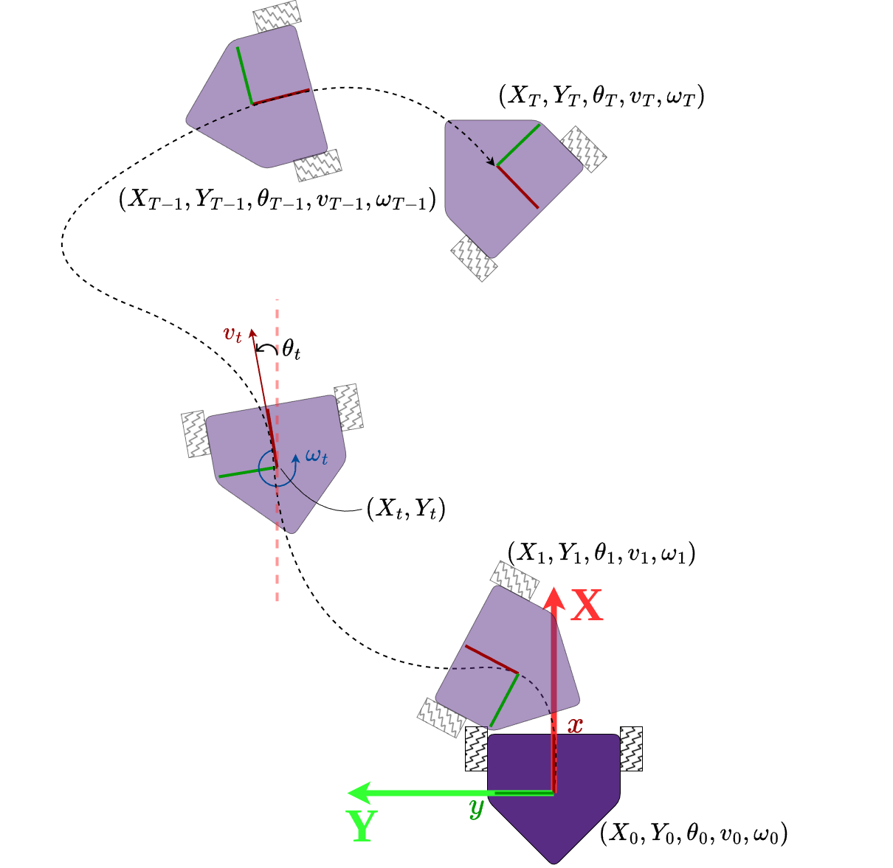

# Naive Odometry

## Objetives

- Build a bare minimal odometry system.
- Compare the robot's actual trajectory to its ideal trajectory.
- Get familiar with [HomeR](https://github.com/linzhangUCA/homer)'s control system.

## Requirements

### 1. (40%) Collect Velocity Data (Pico MicroPython)

Run [vel_data_collect.py](vel_data_collect.py) to drive your robot and collect data.
Uncomment the last 3 lines, store the target and actual velocity data on your Pico.

1. (20%) Lift the wheels and have a no-load test run on desktop. Collect data and upload the saved data to [data](/data/) directory in this repository.
2. (20%) Put the robot down on the ground to test again. Collect data and upload the saved data to [data](/data/) directory in this repository.

### 2. (60%) Calculate Trajectories

Complete [plot_traj.py](plot_traj.py). Code the sections wrapped between the following comments.

```python
### START CODING HERE ###

### END CODING HERE ###
```

Tackle the following requests.

1. (40%) Calculate the ideal and actual robot trajectories using the collected data.
2. (20%) Plot the desktop and ground trajectories and upload to the [images](images/) directory.

#### Frame Setup


There are 2 reference frames involved.

1. Body frame: $`\{x, y\}`$ is attached to the robot and will translate and rotate along the robot's movement.
2. Global frame: $`\{X, Y\}`$ is fixed on the driving plane and will not move along the robot.

The body frame's origin is sitting at the geometric center of the robot's base plate. The $x$ axis is always pointing to the head of the robot, and the $y$ axis is perpendicular to the $x$ axis and pointing to the left wheel.

The Global frame will be generated according to the initial pose of the robot. The $`\{X, Y\}`$ frame will overlap with the initial $`\{x, y\}`$ frame.

#### Robot's State of Motion

- The robot's motion will be restricted in the two dimensional $`\{X, Y\}`$ plane.
- The robot will start moving at the moment of $t_0$, and end the motion at the instant of $t_T$.
- The robot's state will be examined every $\Delta t$ seconds, hence the $i$-th instant $t_i = t_{i-1} + \Delta t$ (where $i \in `\{ 1, 2, \dots, T \}`$).
- The robot's pose at the $i$-th instant can be represented as $(X_i, Y_i, \theta_i)$ referring to the global frame.
$\theta_i$ is the angle from $X$ to $x$, with counterclockwise to be the positive direction.
- The robot's velocity at the $i$-th instant can be represented as $(v_i, \omega_i)$.
$v_i$ is the robot's linear velocity which is always on the $x$ axis. 
$\omega_i$ is the robot's angular velocity which is an rotational quantity along the axis perpendicular to the $`\{x, y\}`$ plane. 
$\omega_i$ is positive if the direction is counterclockwise.
- The trajectory of the robot can be represented as a sequence of the robot's states and can be illustrated as shown in the following figure.
```math
\{(X_0, Y_0, \theta_0, v_0, \omega_0), (X_1, Y_1, \theta_1, v_1, \omega_1), \dots, (X_T, Y_T, \theta_T, v_T, \omega_T)\}
```


At instant $t_i$, the change of the robot's pose can be calculated *approximately* as:
```math
\Delta X_i = v_i \cos \theta_i \Delta t
```
```math
\Delta Y_i = v_i \sin \theta_i \Delta t
```
```math
\Delta \theta_i = \omega_i \Delta t

```
Therefore, the robot's new pose at $t_{i+1}$ can be calculated as:
```math
X_{i+1} = X_i + \Delta X_i
```
```math
Y_{i+1} = Y_i + \Delta Y_i
```
```math
\theta_{i+1} = \theta_i + \Delta \theta_i
```

#### Install Matplotlib

```console
# Run following line in terminal
pip install matplotlib --break-system-packages
```

## AI Policies

Please acknowledge AI's contributions follow the policies in the syllabus.
